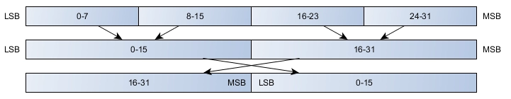

# DataConversion Library

## Overview

Utility for working with different data types in 16-bit packages. Each holding register works with 16-bit words.

This library provides functions to convert standard C++ data types to and from arrays of `uint16_t` (16-bit words). This is particularly useful for communication protocols like Modbus, where data is often exchanged in 16-bit registers. The library helps in packing larger data types (like 32-bit integers or floats) into multiple 16-bit words and unpacking them back.

## Features

*   Supports conversion for various data types:
    *   `int8_t`
    *   `uint8_t`
    *   `int16_t` (implied, as `uint16_t` is the base)
    *   `uint16_t` (base unit)
    *   `int32_t`
    *   `uint32_t`
    *   `float` (32-bit floating point)
    *   `int64_t`
    *   `uint64_t`
    *   `double` (64-bit floating point)
*   Provides bit manipulation functions for `uint16_t` data:
    *   `setBit(data, bitPosition)`: Sets a specific bit.
    *   `clearBit(data, bitPosition)`: Clears a specific bit.
    *   `readBit(data, bitPosition)`: Reads the state of a specific bit.
    *   `toggleBit(data, bitPosition)`: Toggles a specific bit.

## Modbus Data Representation

In Modbus register tables, the following data types commonly appear:

| Name     | Description                              | Range                                                   |
| -------- | ---------------------------------------- | ------------------------------------------------------- |
| UINT     | Unsigned 16-bit integer (1 register)   | 0...65535                                               |
| INT      | Signed 16-bit integer (1 register)     | -32768...+32767                                         |
| UINT32   | Unsigned 32-bit integer (2 registers)  | 0...4,294,967,295                                       |
| INT32    | Signed 32-bit integer (2 registers)    | -2,147,483,648...+2,147,483,647                         |
| INT64    | Signed 64-bit integer (4 registers)    | -9,223,372,036,854,775,808...9,223,372,036,854,775,807  |
| Float32  | 32-bit floating point value (2 registers) | -3.4028E+38...+3.4028E+38                               |
| ASCII    | 8-bit alphanumeric character           | ASCII character table                                   |
| BITMAP   | 16-bit field (1 word)                  | –                                                       |
| DATETIME | See below                                | –                                                       |
Table 1: Modbus Data Types

**NOTE:**

*   `Float32` Data type: single-precision float with a sign bit, 8-bit exponent, 23-bit mantissa (positive and negative normalized real).
*   For ASCII data type, the transmission order of characters in words (16-bit registers) is as follows:
    *   Character n of non-significant weight
    *   Character n + 1 of significant weight
*   All registers (16-bit or 2 bytes) are typically transmitted with Big Endian encoding for the bytes within the word:
    *   The most significant byte is transmitted first.
    *   The least significant byte is transmitted second.
*   32-bit variables stored in two 16-bit words (e.g., consumption meters) are in Big Endian word order:
    *   The most significant word is transmitted first, then the least significant word.
*   64-bit variables stored in four 16-bit words (e.g., dates) are in Big Endian word order:
    *   The most significant word is transmitted first, and so on.

**Endianness Clarification:**

This library implements **Big Endian word order** for multi-register values. This means that for data types like `uint32_t`, `float`, `int64_t`, etc., which are split into multiple `uint16_t` words, the library arranges these words such that the Most Significant Word (MSW) comes first in the resulting array.

For example, when splitting a `uint32_t` into two `uint16_t`s, `word[0]` will be the MSW and `word[1]` will be the Least Significant Word (LSW). Similarly, when merging, `word[0]` is expected to be the MSW.

It is crucial to understand that this library **assumes the underlying Modbus communication stack handles the transmission of each individual 16-bit word in Big Endian byte order** (Most Significant Byte first). Microcontrollers like Arduino and ESP32 are typically Little Endian. This means that while the library correctly orders the *words*, the byte order *within each word* must be managed by the Modbus stack (e.g., by swapping bytes before transmission if the stack doesn't do it automatically on Little Endian systems). Most Modbus libraries for Arduino/ESP32 handle this byte swap automatically.

Let's start with the explanation.

There is no defined standard for storing values greater than 16 bits in Modbus registers, but there is a convention. Here is a graphical explanation of how 32-bit registers are normally stored in 2 16-bit registers.



Figure 1.

**Sources:**

*   [Schneider Electric](https://product-help.schneider-electric.com/ED/PowerTag/Smartlink_SIB/EDMS/DOCA0123ES/DOCA0123xx/Tables_of_Modbus_Registers/Tables_of_Modbus_Registers-4.htm "Data Types")
*   [National Instruments](https://www.ni.com/en-us/innovations/white-papers/14/the-modbus-protocol-in-depth.html "What is Modbus Protocol and How Does It Work?")
*   [Industruino](https://industruino.com/blog/our-news-1/post/modbus-tips-for-industruino-26#blog_content "Split 32-bit values into 16-bit registers")

## Data Type Sizes and Conversions

The size of standard C++ data types can vary by platform. The following table shows typical sizes on different architectures:

| Type        | atmega328p (Arduino Uno) | esp32 | rpi 3 (ARM32) | Win x64 (MSC++) | Win x64 (G++) | Linux x64 (g++) |
| ----------- | ------------------------ | ----- | ------------- | ----------------- | ------------- | --------------- |
| bool        | 1 byte                   | 1 byte| 1 byte        | 1 byte            | 1 byte        | 1 byte          |
| char        | 1 byte                   | 1 byte| 1 byte        | 1 byte            | 1 byte        | 1 byte          |
| int         | 2 bytes                  | 4 bytes| 4 bytes        | 4 bytes            | 4 bytes        | 4 bytes          |
| long        | 4 bytes                  | 4 bytes| 4 bytes        | 4 bytes            | 4 bytes        | 8 bytes          |
| long long   | 8 bytes                  | 8 bytes| 8 bytes        | 8 bytes            | 8 bytes        | 8 bytes          |
| float       | 4 bytes                  | 4 bytes| 4 bytes        | 4 bytes            | 4 bytes        | 4 bytes          |
| double      | 4 bytes (same as float)  | 8 bytes| 8 bytes        | 8 bytes            | 8 bytes        | 8 bytes          |
| long double | 4 bytes                  | 8 bytes| 8 bytes        | 8 bytes            | 16 bytes       | 16 bytes         |
Table 2: Data type sizes (in bytes) across different platforms.

Source: [LUIS LLAMAS](https://www.luisllamas.es/tamanos-de-variables-en-esp32-arduino-raspberry-pi-windows-y-linux/ "VARIABLE SIZES IN ESP32, ARDUINO, RASPBERRY PI, WINDOWS AND LINUX")

Based on Table 2, if we convert these sizes to the number of 16-bit words required for ESP32:

| Type        | atmega328p (16-bit words) | esp32 (16-bit words) |
| ----------- | ------------------------- | -------------------- |
| bool        | 0.5                       | 0.5                  |
| char        | 0.5                       | 0.5                  |
| int         | 1                         | 2 (ESP32 int is 4 bytes) |
| long        | 2                         | 2 (ESP32 long is 4 bytes) |
| long long   | 4                         | 4                    |
| float       | 2                         | 2                    |
| double      | 2 (double is float on Uno)| 4                    |
| long double | 2                         | 4                    |
Table 3: Data types represented in number of 16-bit words.

**Note:** Table 3 provides a conceptual mapping. This library primarily focuses on converting to/from `uint16_t` arrays, and the number of words depends on the source type's size (e.g., a 32-bit `float` will always use two `uint16_t` words).

The library supports conversions for:
*   Reading and writing individual bits within a 16-bit word.
*   Converting `uint8_t` and `int8_t` to/from a `uint16_t` (typically packing two 8-bit values into one 16-bit word, or one 8-bit value into a 16-bit word with padding).
*   Converting `uint32_t`, `int32_t`, and `float` (32-bit) to/from two `uint16_t` words.
*   Converting `uint64_t`, `int64_t`, and `double` (64-bit) to/from four `uint16_t` words.

Min/Max values for common types:

| Description                             | Minimum Value                                | Maximum Value                                |
| --------------------------------------- | :-------------------------------------------: | :------------------------------------------: |
| 16-bit Bitfield                         | `0b0000000000000000`                          | `0b1111111111111111`                         |
| `uint16_t` (unsigned int)               | 0                                             | 65535                                        |
| `int16_t` (signed int)                  | -32768                                        | 32767                                        |
| `uint32_t` (unsigned long on ESP32)     | 0                                             | 4,294,967,295                                |
| `int32_t` (signed long on ESP32)        | -2,147,483,648                                | 2,147,483,647                                |
| `int64_t` (long long)                   | -9,223,372,036,854,775,808                    | 9,223,372,036,854,775,807                    |
| `float` (32-bit)                        | approx. 1.18e-38 (7 significant digits)       | approx. 3.40e+38 (7 significant digits)      |
| `double` (64-bit on ESP32)              | approx. 2.23e-308 (15-16 significant digits)  | approx. 1.79e+308 (15-16 significant digits) |

## Floating Point Precision

The precision of a floating-point number (float) refers to how many significant digits it can represent without loss of accuracy. In the case of single-precision floating-point numbers (float), they can accurately represent between 6 and 7 decimal digits. This means that if you try to store a number with more than 7 decimal digits in a float variable, you may lose precision, and the stored number may not be exactly equal to the original number.

It is important to note that precision refers to the total number of digits, not just the digits to the right of the decimal point. For example, the number 123456.789 has 9 total digits, so if you try to store it in a float variable, you may lose precision.

If you need to represent numbers with more than 7 decimal digits accurately, you can use the `double` data type, which has a precision of about 15-16 decimal digits.

The sign is not counted as a digit of precision in a float variable. The precision of a float variable refers to the number of significant digits it can represent without losing accuracy. The sign of a number (positive or negative) is stored separately and does not affect the precision of the number.

## Installation

### Arduino Library Manager
This library is not yet registered with the Arduino Library Manager. You can install it manually or by importing the .zip file.

### Importing .zip
1.  Download the latest release as a .zip file from the GitHub repository.
2.  In the Arduino IDE, go to `Sketch` > `Include Library` > `Add .ZIP Library...`.
3.  Select the downloaded .zip file.

### Manual Installation
1.  Clone this repository or download it as a .zip file and extract it.
2.  Move the extracted folder (should be named `DataConversion` or similar) to your Arduino libraries folder. This is typically found in:
    *   Windows: `Documents\Arduino\libraries\`
    *   macOS: `~/Documents/Arduino/libraries/`
    *   Linux: `~/Arduino/libraries/`
3.  Restart the Arduino IDE.

## Usage

Here are some basic examples of how to use the library:

```cpp
#include <Arduino.h>
#include <DataConversion.h>

void setup() {
  Serial.begin(115200);

  // Example 1: Splitting a uint32_t into two uint16_t words
  uint32_t myUint32 = 0xABCDEF12;
  uint16_t words32[2];
  DataConversion::splitUint32ToUint16(myUint32, words32[0], words32[1]);
  Serial.print("Original uint32_t: 0x");
  Serial.println(myUint32, HEX);
  Serial.print("Word 0 (MSW): 0x");
  Serial.print(words32[0], HEX);
  Serial.print(", Word 1 (LSW): 0x");
  Serial.println(words32[1], HEX); // Expected: words32[0]=0xABCD, words32[1]=0xEF12

  // Example 2: Merging two uint16_t words into a float
  uint16_t floatWords[2];
  floatWords[0] = 0x41F0; // MSW for 30.0f (approx)
  floatWords[1] = 0x0000; // LSW
  float myFloat = DataConversion::mergeUint16ToFloat32(floatWords[0], floatWords[1]);
  Serial.print("\nMerged float: ");
  Serial.println(myFloat);

  // Example 3: Using bit manipulation - set a bit
  uint16_t myRegister = 0b1010101010101010; // 43690
  Serial.print("\nOriginal register: 0b");
  Serial.println(myRegister, BIN);
  
  myRegister = DataConversion::setBit(myRegister, 3); // Set bit 3 (0-indexed)
  Serial.print("After setting bit 3: 0b");
  Serial.println(myRegister, BIN); // Expected: 0b1010101010101110 (43694)
  
  bool bit5status = DataConversion::readBit(myRegister, 5);
  Serial.print("Status of bit 5: ");
  Serial.println(bit5status ? "Set" : "Clear");

}

void loop() {
  // put your main code here, to run repeatedly:
}
```

## API Reference

The library provides a set of static methods within the `DataConversion` class.

### Conversion Functions:
These functions convert data to/from an array of `uint16_t` words, following Big Endian word order (Most Significant Word first).

*   `static uint16_t mergeInt8ToUint16(int8_t firstI8Value, int8_t secondI8Value);`
*   `static void splitUint16ToInt8(uint16_t valueUi16, int8_t &firstI8Value, int8_t &secondI8Value);`
*   `static uint16_t mergeUint8ToUint16(uint8_t firstUi8Value, uint8_t secondUi8Value);`
*   `static void splitUint16ToUint8(uint16_t valueUi16, uint8_t &firstUi8Value, uint8_t &secondUi8Value);`
*   `static int32_t mergeUint16ToInt32(uint16_t ui16part1, uint16_t ui16part2);`
*   `static void splitInt32ToUint16(int32_t valueI32, uint16_t &ui16part1, uint16_t &ui16part2);`
*   `static uint32_t mergeUint16ToUint32(uint16_t ui16part1, uint16_t ui16part2);`
*   `static void splitUint32ToUint16(uint32_t valueUi32, uint16_t &ui16part1, uint16_t &ui16part2);`
*   `static float mergeUint16ToFloat32(uint16_t ui16part1, uint16_t ui16part2);`
*   `static void splitFloat32ToUint16(float valueF32, uint16_t &ui16part1, uint16_t &ui16part2);`
*   `static int64_t mergeUint16ToInt64(uint16_t p1, uint16_t p2, uint16_t p3, uint16_t p4);`
*   `static void splitInt64ToUint16(int64_t val, uint16_t &p1, uint16_t &p2, uint16_t &p3, uint16_t &p4);`
*   `static uint64_t mergeUint16ToUint64(uint16_t p1, uint16_t p2, uint16_t p3, uint16_t p4);`
*   `static void splitUint64ToUint16(uint64_t val, uint16_t &p1, uint16_t &p2, uint16_t &p3, uint16_t &p4);`
*   `static double mergeUint16ToDouble(uint16_t p1, uint16_t p2, uint16_t p3, uint16_t p4);`
*   `static void splitDoubleToUint16(double val, uint16_t &p1, uint16_t &p2, uint16_t &p3, uint16_t &p4);`

### Bit Manipulation Functions (for `uint16_t`):
*   `static uint16_t setBit(uint16_t data, uint8_t bitPosition);`
*   `static uint16_t clearBit(uint16_t data, uint8_t bitPosition);`
*   `static bool readBit(uint16_t data, uint8_t bitPosition);`
*   `static uint16_t toggleBit(uint16_t data, uint8_t bitPosition);`

Detailed API documentation is available in the Doxygen comments within `DataConversion.h`.

## Examples

The library includes several examples in the `src/Examples/` directory to demonstrate its usage:

*   **`ExampleAll.ino`**: A comprehensive demonstration showing how to use all merge and split functions for various data types. It also includes usage of the bit manipulation functions.
*   **`NewBitManipulation.ino`**: Specifically highlights the usage of the new bit manipulation functions (`setBit`, `clearBit`, `readBit`, `toggleBit`).
*   **`BitTo16bitRegister.ino`**: Shows how to read and write individual bits of a 16-bit register using the library's bit manipulation functions. This example demonstrates their use as a platform-independent alternative to Arduino's built-in `bitRead()` and `bitWrite()`.
*   Other examples (e.g., `SplitMergeInt8ToUInt16.ino`, `SplitMergeUint16ToFloat32.ino`, etc.) provide focused demonstrations for specific data type conversions.

These examples are designed to be run on Arduino-compatible platforms like ESP32 or Arduino Uno and typically output results to the Serial Monitor.

## Contributing

Contributions are welcome! If you find any issues or have suggestions for improvements, please open an issue or submit a pull request on the GitHub repository.

## License

This project is licensed under the MIT License - see the [LICENSE](LICENSE) file for details.
